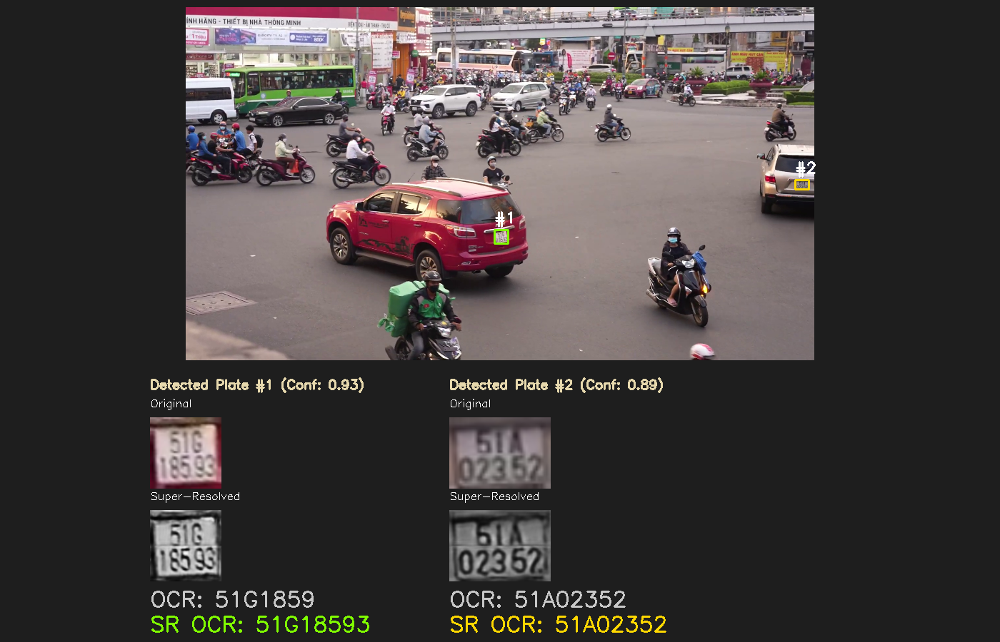
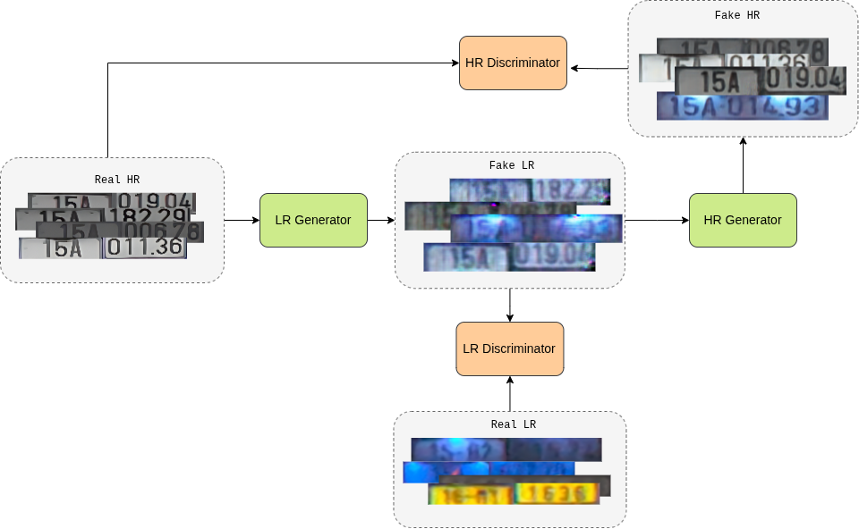
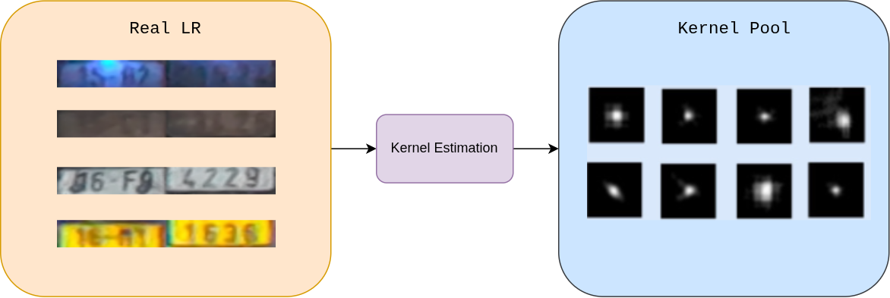
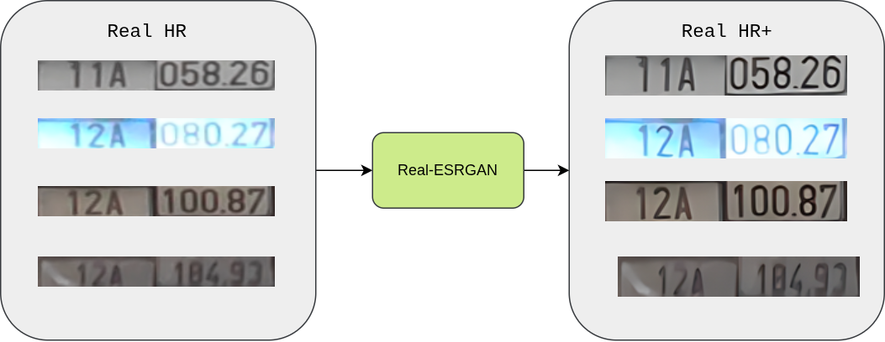
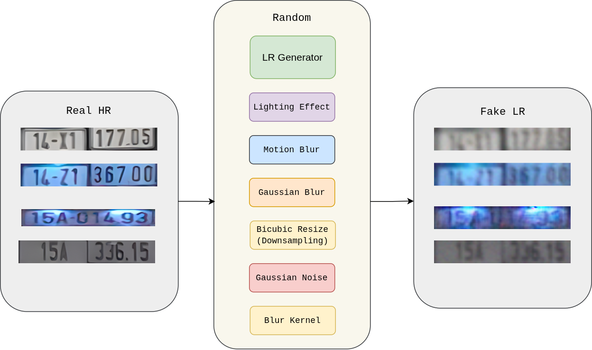
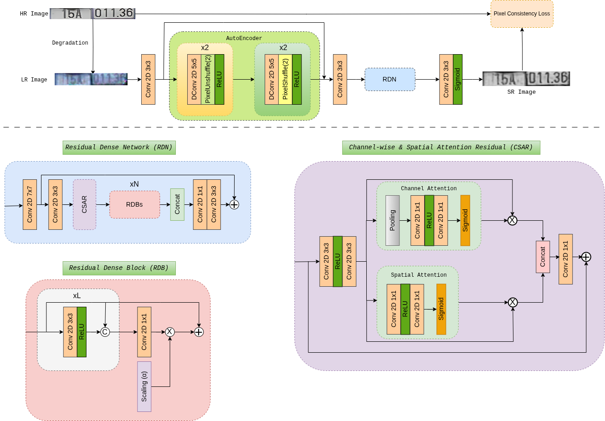
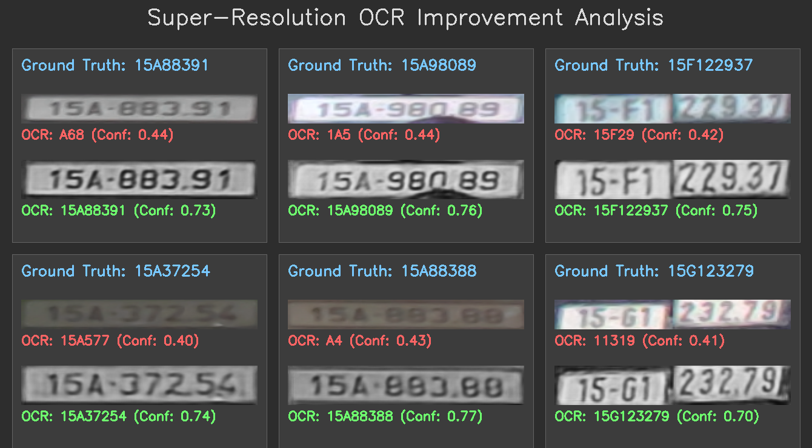

# End-to-End License Plate Super-Resolution and Recognition


This project presents a complete pipeline for license plate super-resolution, data generation, model training, and evaluation. The primary goal is to enhance the quality of low-resolution license plate images to significantly improve the accuracy of Optical Character Recognition (OCR) systems in real-world scenarios.




<p align="center"><em>Survey Paper</em></p>
---

## Table of Contents
- [Introduction](#introduction)
- [Methodology](#methodology)
  - [1. Realistic Data Degradation Pipeline](#1-realistic-data-degradation-pipeline)
  - [2. Super-Resolution Model Architecture](#2-super-resolution-model-architecture)
- [Installation](#installation)
- [Usage](#usage)
  - [1. Train CycleGAN for Data Generation](#1-train-cyclegan-for-data-generation)
  - [2. Train the Super-Resolution (LPSR) Model](#2-train-the-super-resolution-lpsr-model)
  - [3. (Optional) Export Models to ONNX for Deployment](#3-optional-export-models-to-onnx-for-deployment)
  - [4. Evaluate the Trained Models](#4-evaluate-the-trained-models)
  - [5. Run the Full Inference Pipeline](#5-run-the-full-inference-pipeline)
- [Evaluation](#evaluation)
  - [Quantitative Results](#quantitative-results)
  - [Qualitative Results](#qualitative-results)
- [Future Work](#future-work)
- [Acknowledgements](#acknowledgements)

---

## Introduction

In real-world applications, license plate images captured by surveillance cameras are often low-resolution, blurry, and noisy due to weather conditions, lighting, motion, or distance. A major challenge in developing robust super-resolution models is the lack of paired data—corresponding high-resolution (HR) and low-resolution (LR) images from the same scene.

Traditional methods create synthetic LR images by applying simple mathematical degradations (like Gaussian blur or down-sampling) to HR images. However, this approach produces artificial LR images that fail to capture the diversity and complexity of real-world quality degradation factors.

This project introduces a **Hybrid Degradation Pipeline** to generate more realistic HR-LR data pairs, which are then used to train an effective Super-Resolution model for the specific task of improving OCR accuracy.

## Methodology

The project workflow consists of two main stages: data generation, SR model training.

### 1. Realistic Data Degradation Pipeline

To address the data scarcity problem, we propose a novel method for generating realistic LR images from real HR images via a hybrid pipeline that combines three techniques:

* **Learning Degradation with CycleGAN:** We train a CycleGAN model on an unpaired dataset of real HR images (Domain A) and real-world LR images (Domain B). The resulting generator, `G_AtoB`, learns a mapping to transform a clean HR image into a realistic-looking LR image.


* **Real-World Blur Kernel Estimation:** Using kernel estimation algorithms, we extract authentic blur kernels from real-world LR images. This allows us to accurately simulate blur caused by camera motion or focus issues.


* **Enhancing Original HR Images with Real-ESRGAN:** The purpose of this step is to "clean" and enhance the image quality, producing an ultra-sharp **"HR+"** version. This "HR+" image then serves as the definitive ground truth for our degradation pipeline in the next step.


* **Hybrid Degradation Synthesis:** From a single "HR+" input image, we generate its corresponding LR counterpart through a stochastic pipeline. For each image, we apply a **random combination and sequence** of degradations drawn from our toolbox, which includes:
    1.  Traditional manual transformations (Gaussian blur, noise, compression artifacts,...).
    2.  The trained `G_AtoB` LR Generator from our CycleGAN.
    3.  Convolution with one of the estimated real-world blur kernels.


This approach yields a diverse, realistic, and high-quality dataset for training our Super-Resolution model.

### 2. Super-Resolution Model Architecture

With the prepared dataset, we train a Super-Resolution model (LPSR). This model is designed to restore and enhance low-quality plate images, functioning at a 1x scale (input shape equals output shape).

Our Super-Resolution model architecture, `LPSR`, is designed as a deep processing pipeline composed of two main stages: an initial **AutoEncoder** for preliminary feature extraction, followed by an advanced **Residual Dense Network (RDN)** for deep feature refinement.

The architecture is built from the following key components:

* **AutoEncoder:** This module features a U-Net-like structure, utilizing `PixelUnshuffle` for down-sampling and `PixelShuffle` for up-sampling, allowing the model to learn features at multiple scales.
* **Residual Dense Network (RDN):** This is the core of the model. It consists of:
    * **`RDB` (Residual Dense Block) modules:** Each block contains densely connected convolution layers to maximize feature flow.
    * **`CSAR` (Channel & Spatial Attention Residual) block:** After each `RDB`, a `CSAR` attention module is inserted to help the model focus on the most informative feature channels and spatial regions.
    * **Global Feature Fusion & Residual Learning:** Features from all blocks are fused, and a global residual connection ensures stable and effective training.
* **Final Convolution Layer:** The refined features are passed through a final convolutional layer and a `Sigmoid` function to reconstruct the enhanced image in the range [0, 1].



## Installation

Clone this repository:

    ```bash
    git clone https://github.com/nhanth301/End-to-End-License-Plate-Detection-and-Recognition-with-Image-Enhancement.git
    cd End-to-End-License-Plate-Detection-and-Recognition-with-Image-Enhancement
    ```
## Usage

This section outlines the full workflow from model training to final evaluation. All steps are executed via Python scripts with command-line arguments.

### 1. Train CycleGAN for Data Generation
This step trains a CycleGAN to learn a realistic mapping from high-resolution (HR) to low-resolution (LR) images.

**Data Preparation:**
Prepare a root data directory with `trainA` (real HR images) and `trainB` (real LR images) subfolders.
```
<path_to_cyclegan_data>/
├── trainA/
│   └── real_hr_image_1.png
└── trainB/
    └── real_lr_image_1.png
```
**Execution:**
Run the CycleGAN training script from the project's root directory. Adjust parameters as needed.
```bash
python -m train.cyclegans \
    --dataroot /path_to_cyclegan_data
    --epochs 100 \
    --batch_size 1 \
    --lr 0.0001 \
    --width 192 \
    --height 32 \
    --checkpoint_dir output/checkpoints \
    --output_dir output/visualizations
```

### 2. Train the Super-Resolution (LPSR) Model
This is the main training step for our custom Super-Resolution model using a prepared paired dataset.

**Data Preparation:**
Prepare a root data directory with four subfolders for training and validation sets.
```
<path_to_lpsr_data>/
├── trainHR/
├── trainLR/
├── valHR/
└── valLR/
```

**Execution:**
Run the LPSR training script, providing paths to your datasets.
```bash
python -m train.lpsr \
    --hr_train_dir /path/to/trainHR \
    --lr_train_dir /path/to/trainLR \
    --hr_val_dir  /path/to/valHR \
    --lr_val_dir  /path/to/valLR \
    --output_dir output \
    --epochs 100 \
    --batch_size 16 \
    --num_workers 4 \
    --lr 0.0001 \
    --width 192 \
    --height 32 
```

### 3. (Optional) Export Models to ONNX for Deployment
Convert your trained PyTorch models to the ONNX format. This step is necessary for deploying with inference servers like NVIDIA Triton.

**Execution:**
It is recommended to run this script as a module from the project's root directory to handle imports correctly.
```bash
# Export the Super-Resolution model
python -m my_utils.export_onnx --model-type sr \
    --weights weights/sr_best.pth \
    --output onnx_models/super_resolution/1/model.onnx

# Export the Plate Detection model
python -m my_utils.export_onnx --model-type detection \
    --weights weights/plate_detection.pt \
    --output onnx_models/detection/1/model.onnx

# Export the OCR model
python -m my_utils.export_onnx --model-type ocr \
    --weights weights/ocr.pt \
    --output onnx_models/ocr/1/model.onnx
```

### 4. Evaluate the Trained Models
This step quantitatively measures the impact of your trained SR model on OCR accuracy.

**Data Preparation:**
Prepare a test folder where each image's filename is its ground truth text (e.g., `51K12345.png`).

**Execution:**
Run the `eval.py` script, providing paths to the evaluation folder and the relevant model checkpoints.
```bash
python -m evaluation.eval \
    --eval-folder /path/to/evaluation_data \
    --sr-weights weights/sr_best.pth \
    --ocr-weights weights/ocr.pt \
    --imgsz-ocr 128 128 \
    --ocr-conf 0.5
```
### 5. Run the Full Inference Pipeline
You can run the end-to-end pipeline in two ways: locally with PyTorch for testing, or with Triton for a production-like environment.

---
#### **Option A: Run with Local PyTorch Models**

This mode is useful for development and debugging, as it loads the `.pt` and `.pth` weight files directly without requiring Docker.

**Execution:**
```bash
python -m inference.run \
    --source /path/to/your/video.mp4 \
    --sr-weights weights/sr_best.pth \
    --d-weights weights/plate_detection.pt \
    --r-weights weights/ocr.pt \
```
---
#### **Option B: Run with Triton Inference Server**

This mode simulates a production environment by sending inference requests to a running Triton server. Ensure you have completed **Step 3 (Export Models to ONNX)** before proceeding.

**Step 5.1: Start the Triton Server**

First, run the Triton server in a terminal using Docker. This server will host your ONNX models.

```bash
# In your first terminal, start the server
# Replace /path/to/your/onnx_models with the absolute path on your host machine
docker run --gpus all --rm -p 8000:8000 -p 8001:8001 -p 8002:8002 -v /path/to/your/onnx_models:/models nvcr.io/nvidia/tritonserver:23.12-py3 tritonserver --model-repository=/models
```
Keep this terminal running.

**Step 5.2: Run the Client Script**

Open a **new terminal** and run the Triton client script. This script will connect to the server you just started.

```bash
# In your second terminal, run the client
python -m inference.triton_run \
    --source /path/to/your/video.mp4 \
    --triton-url "localhost:8000" \
    --detection-classes yolo_classes/detect_class_names.txt \
    --ocr-classes yolo_classes/ocr_class_names.txt \
```

## Evaluation 

This section presents the performance evaluation of the Super-Resolution model.

### Quantitative Results
The following results were obtained on a challenging test set of **1050 license plate images** captured from real-world scenarios, the OCR model's confidence threshold (`--ocr-conf`) was set to **0.5**.

| Metric                        | Baseline (Without SR) | With SR Model | Improvement            |
| ----------------------------- | --------------------- | ------------- | ---------------------- |
| **Full Plate Accuracy** | 26.86%                | 46.57%        | **+19.71%** |
| **Character Error Rate (CER)**| 31.10%                | 12.81%        | **-18.29%** (Error Reduction) |

### Quanlitative Results
Below are examples where the Super-Resolution model significantly improved OCR results compared to the original low-resolution image.



## Future Work
This project has successfully demonstrated the effectiveness of our Super-Resolution approach. However, there are several exciting directions for future improvement and expansion:

1.  **Unifying into a Single-Stage End-to-End Framework**
    During the CycleGAN training, we observed that the `G_BtoA` (Blur-to-Clear) generator is, in essence, a Super-Resolution model itself. An interesting future direction would be to merge the data generation and SR training phases into a single, end-to-end process. Instead of using `G_AtoB` solely for offline data generation, the entire system could be trained in one loop where `G_BtoA` serves as the final SR model. The primary challenge of this approach lies in the complexity of balancing multiple, competing loss functions to ensure stable convergence.

2.  **Controllable Degradation with Conditional GANs (cGANs)**
    The current CycleGAN generates LR images unconditionally, offering limited control over the specific type of degradation produced. A powerful extension would be to evolve this pipeline into a Conditional GAN (cGAN). By providing an additional "style" LR image as a condition alongside the HR input, the model could learn to generate the exact type of blur, noise, or lighting artifact desired. This would not only create a more diverse and realistic training dataset but also serve as an effective method to mitigate mode collapse during GAN training.

3.  **Optimizing the Full Pipeline for Speed (FPS)**
    This project's primary focus was to prove the efficacy of the SR module. Consequently, the detection and recognition models (YOLOv5) were not optimized for inference speed, resulting in a low end-to-end FPS. Future work could focus on performance optimization, including:
    * **Utilizing lighter model backbones:** Employing more lightweight YOLOv5 versions (e.g., YOLOv5n, YOLOv5s) for the detection and OCR tasks.
    * **Applying model optimization techniques:** Using methods such as quantization and pruning to reduce the computational complexity of the models.
    * **Converting models to TensorRT:** Migrating the optimized models to NVIDIA's TensorRT engine to maximize inference throughput on target GPU hardware.
    * **Codebase Refactoring:** Refactoring the core pipeline for improved modularity, reducing I/O bottlenecks, and enhancing overall code quality for better maintainability and extensibility.
    * **Implementing a Multi-threaded/Asynchronous Pipeline:** Parallelizing I/O-bound tasks (like video frame reading) with GPU-bound tasks (model inference). This de-couples the components and can significantly improve overall throughput by ensuring the GPU is never idle.


## Acknowledgements

The plate detection and Optical Character Recognition (OCR) models used in this project are based on the YOLOv5 framework and were adapted from or utilized methodologies from the work of GitHub user **chequanghuy**.

* **Source Repository:** [chequanghuy/Character-Time-series-Matching](https://github.com/chequanghuy/Character-Time-series-Matching)

We would like to thank the author for their valuable work and for sharing a helpful project for the license plate recognition task in the Vietnamese context.

Additionally, a special thanks to the AI assistants, including Google's Gemini and OpenAI's ChatGPT, which were instrumental throughout the development process. Their assistance in debugging complex errors, refactoring code, and writing documentation was invaluable.
